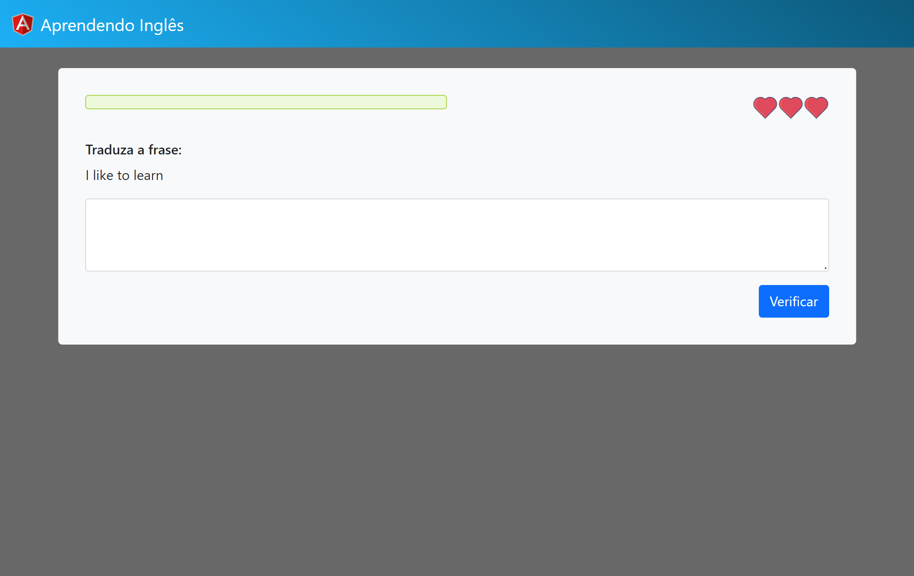

<h1 align="center">:one: Aprendendo Inglês 👩‍🏫</h1>

  <a href="https://rogeriofrsouza.github.io/app1-aprendendo-ingles/" target="_blank">Page</a>&nbsp;&nbsp;&nbsp;|&nbsp;&nbsp;&nbsp;
  <a href="#-tech-stack">Tech Stack</a>&nbsp;&nbsp;&nbsp;|&nbsp;&nbsp;&nbsp;
  <a href="#-project">Project</a>&nbsp;&nbsp;&nbsp;|&nbsp;&nbsp;&nbsp;
  <a href="#-layout">Layout</a>&nbsp;&nbsp;&nbsp;|&nbsp;&nbsp;&nbsp;
  <a href="#-license">License</a>

  

 

## 🚀 Tech Stack

This project was developed using these technologies:

- 
  &nbsp;Angular
- 
  &nbsp;Bootstrap

 

## 💻 Project

- This is a initial and easy project for new Angular developers.
- It's based on a gaming English learning platform.
- 1st application developed in **Desenvolvimento WEB com JavaScript, TypeScript e Angular**. You can check the full course [here](https://www.udemy.com/course/curso-de-desenvolvimento-web-com-es6-typescript-e-angular-4/).

 

## 🔖 Layout

Made by [Jorge Sant Ana](https://www.udemy.com/user/jorgetadeusantanasilva/) 👾

 

## 📝 License

This project is under MIT License. You can check [LICENSE](https://github.com/rogeriofrsouza/app1-aprendendo-ingles/blob/main/LICENSE) for more details.

 

---

Made with ♥ by Rogério :wave:
